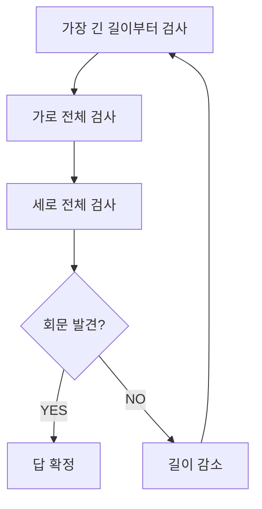

시간복잡도 `O(N^4)`
> Checkpoint : 가로, 세로를 모두 보아 가장 긴 회문의 길이를 구하는 문제
>
> 100*100 이니까 100부터 차례대로 검사해봄
> 

```mermaid
flowchart TD
    A[가장 긴 길이부터 검사] --> B[가로 전체 검사]
    B --> C[세로 전체 검사]
    C --> D{회문 발견?}
    D -->|YES| E[답 확정]
    D -->|NO| F[길이 감소]
    F --> A
```