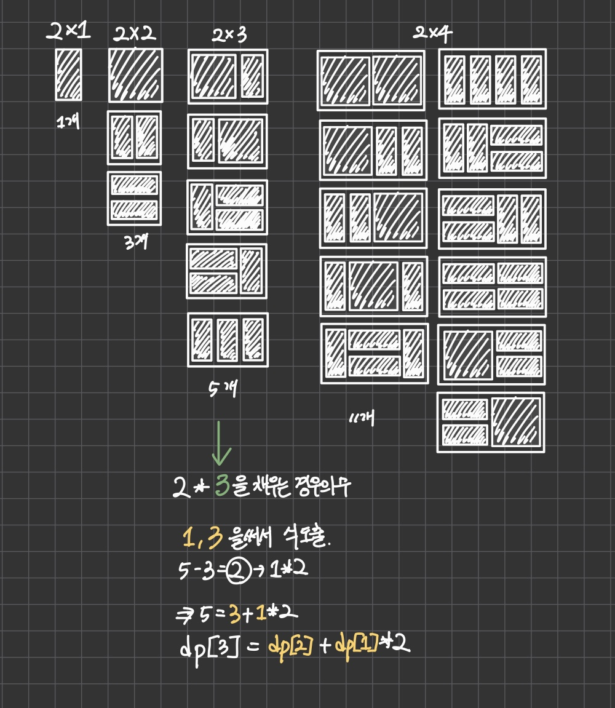

시간복잡도 `O(MAX)`
> Checkpoint : `2*n`의 직사각형을 `2*1`,`2*2`로 채우는 ***경우의 수***
>
> 선택, 조합, 경우의 수 -> DFS / 백트래킹
> 최적값, 이전값 재사용 -> DP
>
> 출력값 비정상적으로 큼

경우의 수를 세는데 이전값 사용이 있으니까 DP 풀이

 
다음단계인 `2*4`에서 도출한 식이 맞는지 체크 
11 = 5 + 3 * 2 
 =>`dp[4] = dp[3] + dp[2] * 2` 
 =>`dp[i] = dp[i-1] + dp[i-2] * 2`

후기: 출력값 고려하려면 자릿수별로 계산해서 `string`으로 보관 or `vector<int>` 사용하는 방법 두가지 있음. 벡터는 이중배열로 출력 때 값 일일이 꺼내야해서 `string`쪽이 더 좋은 듯
